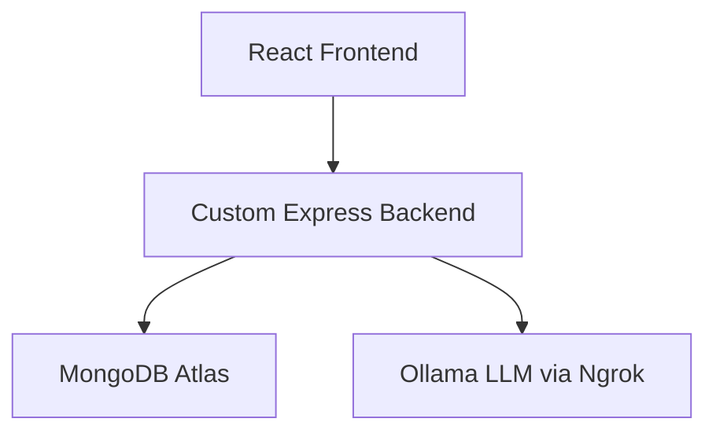

# 🧠 LLM-Based Disease Prediction Web Application

A secure, full-stack AI-driven web application that allows users to input symptoms and receive disease predictions, precautions, and medicine suggestions using a local Large Language Model (LLM) served via Ollama. The app integrates a custom backend, MongoDB database, and a React frontend for a complete healthcare assistant experience.

---

## 📌 Motivation

This project was inspired by a personal experience where I had to wait in a long queue while unwell just to consult a doctor. This prompted me to build a tool that can help users pre-screen symptoms using an AI-based system. The goal is not to replace professional medical advice but to give quick and useful health-related insights when they are most needed.

---

## 🚀 Key Features

- 🔐 **User Authentication**: Signup, Login, Email verification using JWT and Nodemailer.
- 🧬 **Disease Prediction**: LLM analyzes user symptoms and provides:
  - Disease Name + Explanation
  - Suggested Precautions
  - Over-the-counter Medicines
- 💬 **Chatbot**: A built-in health assistant for general symptom queries and tips.
- 🌐 **Cross-platform Access**: Works across devices, powered by Vercel + Render deployment.

---

## 🧠 AI/ML Integration

- **Model Used**: [`mistral`](https://ollama.com/library/mistral) via [Ollama](https://ollama.com/)
- **Serving Mode**: Local LLM server using Ollama
- **Public Access**: Tunnelled using [Ngrok](https://ngrok.com) for integration with the live frontend

---

## 🏗️ Tech Stack

| Layer     | Technology Used                |
|-----------|-------------------------------|
| Frontend  | React.js (Hosted on Vercel)   |
| Backend   | Node.js, Express (Render.com) |
| Database  | MongoDB Atlas                 |
| AI Model  | Ollama (Local LLM Hosting)    |
| Tunneling | Ngrok                         |

---

## 📁 Dataset

- **Source**: [Kaggle Dataset](https://www.kaggle.com/)
- **File**: `Final_Augmented_dataset_Diseases_and_Symptoms.csv` (Over 180MB)
- **Use**: Converted to LLM-friendly prompt-response format for accurate predictions

> ⚠️ The `.env` file and sensitive credentials have been removed for security.

---

## 📸 Screenshots

Screenshots of key app flows:
- Signup
- Email Verification
- Login
- Chatbot & Prediction Dashboard

🎞️ A **video demonstration** is also shared. Authentication sequences were trimmed for security, but screenshots of those parts are included.

---

## 🧩 Application Architecture

---

## 🧪 Challenges

- ❗ Ngrok tunneling disconnects often and causes latency in LLM response
- ⚠️ Large dataset exceeded GitHub’s 100MB limit — handled manually
- ⛔ Ollama flags like `--host` are unsupported in the current version (0.9.3)
- 🔐 Ensuring secure authentication and token storage

---

## 🛣️ Future Improvements

- 📞 Real-time doctor consultation system
- 🗓️ Slot booking for hospitals
- 🎙️ Voice-based symptom entry
- 🌐 Multilingual support
- 🔒 Replace Ngrok with a secure custom tunnel or self-hosted reverse proxy

---

## 📦 Deployment

- **Frontend**: Deployed on [Vercel](https://vercel.com)
- **Backend**: Hosted on [Render](https://render.com)
- **Database**: [MongoDB Atlas](https://www.mongodb.com/cloud/atlas)
- **AI**: Served locally using [Ollama](https://ollama.com) and exposed via [Ngrok](https://ngrok.com)

---

## 🔗 Links

- 🔗 GitHub Repository: [LLM_Based_Web_App_Diesease_Prediction](https://github.com/vivekOJ1129/LLM_Based_Web_App_Diesease_Prediction)
- 📽️ Project Demo Video: *Provided Separately*
- 📝 PDF Report: [LLM_WEB_Report.pdf](./LLM_WEB_Report.pdf)

---

## 👨‍💻 Author

**Vivekanand Ojha**  
📧 Email: vivekanandojha09@gmail.com  
💻 GitHub: [@vivekOJ1129](https://github.com/vivekOJ1129)  
🔗 LinkedIn: [linkedin.com/in/vivekanand-ojha](https://www.linkedin.com/in/vivekanand-ojha)

---

> 🚨 Disclaimer: This project is a prototype and should not be used for actual medical diagnosis or treatment. Always consult a healthcare professional.
